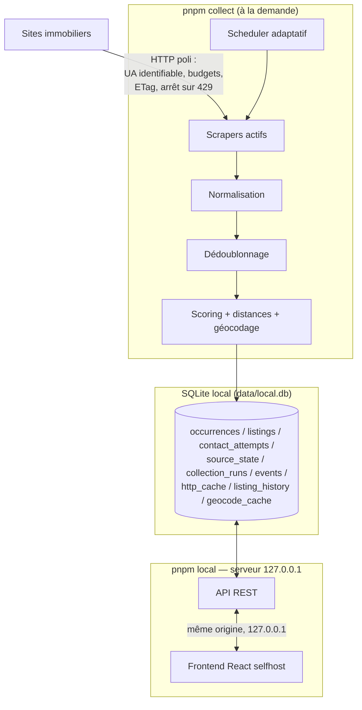

# Architecture

## Vue d'ensemble

RentFinder est **100% local** : tout tourne sur la machine de l'utilisateur,
relié par un fichier SQLite et par les types du paquet `@rentfinder/shared` :



Le flux de données suit la chaîne du §78 :

```
COLLECTER → NORMALISER → DÉDOUBLONNER → FILTRER → SCORER → PRIORISER → CONTACTER → MESURER
```

## Composants et responsabilités

### `packages/shared` — contrats

Types partagés par tout le système, aucune logique, aucune dépendance (§48).
Contient le modèle de données à quatre étages :

```
RawListing            ce qu'un scraper extrait (chaînes brutes)
  ↓ normalisation
NormalizedListing     annonce typée, propre à UNE source (= une "occurrence")
  ↓ dédoublonnage + fusion
AggregatedListing     un logement unique, champs MergedField<T> avec provenance
  ↓ scoring
ScoredListing         + 4 scores expliqués + distances + matchesCriteria
```

Deux types transversaux portent les principes du projet :

- `Maybe<T> = T | null` — `null` signifie « la source ne fournit pas cette
  information ». Jamais remplacé par une estimation (§17).
- `MergedField<T>` — valeur retenue + source + **conflits conservés** quand les
  sources divergent (§15).

Le module `message.ts` (génération des messages de contact) vit ici parce que
le frontend (mode manuel) et le collecteur (mode auto futur) l'utilisent tous
deux (§24, §75).

### `packages/collector` — collecte et pipeline

| Répertoire       | Rôle                                                                                                                              |
| ---------------- | --------------------------------------------------------------------------------------------------------------------------------- |
| `core/`          | clock injectable, logger auto-expurgeant, rate limiter, client HTTP (point de passage unique), budgets par famille, registre, géo |
| `scheduler/`     | décisions pures « quelle source tourne maintenant » (§7)                                                                          |
| `sources/`       | un répertoire par source : `parser.ts` (pur) + `index.ts` (scraper)                                                               |
| `normalization/` | texte français, nombres français, champs d'annonce                                                                                |
| `deduplication/` | similarité multi-signaux, blocage, union-find, fusion                                                                             |
| `scoring/`       | les 4 scores + distances                                                                                                          |
| `contact/`       | garde-fous du contact automatique (`guards.ts`)                                                                                   |
| `db/`            | client libsql, migrations, repository économe en écritures                                                                        |
| `cli/`           | `collect.ts` (collecte), `serve.ts` (serveur local), `migrate.ts`                                                                 |
| `server/`        | routes de l'API locale (`routes.ts`)                                                                                              |
| `pipeline.ts`    | orchestration d'un run complet, isolation des pannes                                                                              |

Frontières strictes :

- Un **scraper** ne fait qu'extraire. Il ne parse pas les nombres, ne
  normalise pas, n'écrit pas en base, et n'appelle jamais `fetch` directement —
  il reçoit un `ScrapeContext` dont le `fetch` applique budget, cache et arrêt
  sur 429 (§10, §76).
- La **normalisation** ne connaît aucune particularité de site.
- Le **repository** est le seul code qui parle SQL.

### `collector/src/server` — API locale

Les routes REST (`routes.ts`) consommées par le serveur local (`cli/serve.ts`).
Le serveur n'écoute que sur `127.0.0.1` : injoignable depuis le réseau ou
Internet, donc **aucun jeton nécessaire**. Ne jamais changer l'adresse
d'écoute sans réintroduire une authentification (§26).

### `frontend/` — interface

React + Vite, trois vues (liste / fiche / profil+sources). Deux modes :

- **démo** (`pnpm dev`) : données fictives de `mock-data.ts`, sans base ;
- **local** (`pnpm local`) : servi par le serveur local, même origine.

Le profil locataire est stocké uniquement dans le navigateur ; le message de
contact est composé localement et n'est jamais transmis à l'API (§25, §26).

## Décisions structurantes et leurs raisons

| Décision                                      | Raison                                                                                                            |
| --------------------------------------------- | ----------------------------------------------------------------------------------------------------------------- |
| TypeScript partout                            | un seul modèle de données partagé compilé, une seule CI                                                           |
| 100% local (SQLite + serveur 127.0.0.1)       | pas de quota, pas de secret à gérer ; les données ne quittent jamais la machine (§26)                             |
| Base en mémoire en test                       | même API libsql ; les tests exercent le vrai code sans toucher la base de travail (§52)                           |
| `content_hash` par ligne                      | une annonce revue à l'identique ne coûte aucune écriture (§30)                                                    |
| Dédoublonnage par blocage + union-find        | O(n²) interdit au-delà de quelques milliers d'annonces (§56)                                                      |
| Paires ambiguës **non** fusionnées par défaut | fusionner deux logements distincts fait disparaître une annonce réelle ; un doublon affiché est moins grave (§14) |
| Horloge injectable (`Clock`)                  | tests déterministes, aucune dépendance à l'heure réelle (§59)                                                     |

## Limites connues

- Les distances sont à vol d'oiseau × 1,3 (facteur urbain), pas des itinéraires
  réels — suffisant pour classer, pas pour planifier (§20 MVP).
- `VISIT PROBABILITY` est un indice à base de règles, pas une statistique ;
  l'interface l'affiche avec cet avertissement (§18).
- La collecte est déclenchée manuellement (`pnpm collect`) : à vous de la
  relancer pour rafraîchir. Pas de collecte automatique en arrière-plan.
- Le tri « annonces les plus fraîches d'abord » suppose que la source liste les
  nouveautés en tête — vrai pour Laforêt, à vérifier par source (§9).

## Scoring

Quatre scores sur 100, calculés par `scoring/` pour chaque logement agrégé.
Trois règles transverses, non négociables :

1. **Jamais de donnée inventée** (§17). Un signal absent ne contribue pas et
   figure dans `unknownSignals`. L'interface marque ces scores d'un astérisque
   « calculé sans : … ».
2. **Toujours explicable** (§19). Chaque score rend ses `reasons[]` (code
   stable + libellé + delta), affichées telles quelles dans la fiche.
3. **Confiance affichée**. `confidence ∈ [0,1]` décroît avec chaque signal
   manquant — un score complet et un score calculé sur trois miettes ne se
   présentent pas pareil.

### MATCH — « correspond-il à mes critères ? » (§16)

Critères MVP : ville ∈ {nice}, loyer ≤ 700 €, surface ≥ 14 m² (12 m² à
l'origine, relevé le 2026-08-15). Source unique : `MVP_CRITERIA` dans
`packages/shared/src/criteria.ts` — les docs peuvent dater, le code fait foi.

- Les trois critères actifs sont **éliminatoires** : une violation met
  `matchesCriteria = false` — l'annonce reste collectée et consultable, mais
  sort de la liste principale (§53 scénario 3).
- En deçà des seuils, le score module : loyer plus bas sous le plafond → plus
  de points ; surface au-delà du minimum → bonus dégressif.
- **Un critère inconnu n'élimine pas** : surface non publiée ≠ surface trop
  petite. Le score est rapporté au total réellement évaluable.
- Extension : les critères optionnels (`propertyTypes`, `furnished`…) du type
  `SearchCriteria` sont déjà branchés ; en activer un = le renseigner dans la
  config, aucune modification de structure (§2).

### OPPORTUNITY — « dois-je agir maintenant ? » (§17)

| Facteur                                                   | Poids max |
| --------------------------------------------------------- | --------- |
| Fraîcheur (paliers : < 15 min = 50 pts … < 1 sem = 5 pts) | 50        |
| Téléphone disponible                                      | 20        |
| E-mail disponible                                         | 10        |
| Multi-diffusion (concurrence probable → agir vite)        | 10        |
| Vues/h élevées, favoris — **uniquement si publiés**       | 10 + 5    |

Si la source ne donne pas `publishedAt`, la date de première observation sert
de borne honnête, à 70 % des points, et l'écart est déclaré (« date de
publication non fournie »). Favoris absents = inconnus, jamais zéro.

### VISIT PROBABILITY — « mon contact aboutira-t-il ? » (§18)

**Avertissement méthodologique**, repris dans l'interface : ce score n'est PAS
une probabilité statistique. C'est un indice à base de règles explicites,
utile pour **comparer** les annonces entre elles, pas pour prédire « 84 % de
chances ». Il ne prétend à aucune précision qui n'existe pas.

Base neutre 40, puis : délai depuis publication (contact dans l'heure : +25 ;
annonce de > 3 jours : −20), canal disponible (téléphone +20, e-mail +10,
formulaire +3, rien −15), nature du bailleur, concurrence multi-portails (−10).

Le paramètre `observedStats.visitRateBySource` est prévu pour la V2 : quand le
journal des contacts (§33) aura accumulé des résultats réels, les taux
constatés corrigeront les règles — sans les écraser tant que l'échantillon est
petit.

### RISK — « cette annonce est-elle suspecte ? » (§19)

Voir le détail dans [risk-detection.md](risk-detection.md). L'essentiel :

- **jamais bloquant** — une annonce risquée reste visible avec ses raisons ;
- loyer/m² comparé à une référence configurable (20 €/m² pour Nice, hypothèse
  de travail assumée, pas un prix de marché constaté) ;
- incohérences internes (4 pièces pour 20 m²), contradictions **significatives**
  entre sources (> 15 % loyer, > 10 % surface), identité invérifiable,
  formulations d'arnaque classiques.

### Priorité d'action (tri de la liste, §36)

```
priorité = 0,30·match + 0,35·opportunity + 0,25·visitProbability + 0,10·(100 − risk)
```

L'opportunité pèse le plus lourd : sur un marché tendu, la question de
l'interface est « que dois-je contacter _maintenant_ ? », pas « quelle est la
meilleure affaire dans l'absolu ». Poids volontairement simples et lisibles ;
ils seront réévalués sur données réelles en V3 (§71), pas avant.

### Faire évoluer un score

1. Ajouter la règle avec un `code` stable et un libellé affichable.
2. Si le signal peut manquer : le déclarer dans `unknownSignals`, ajuster
   `confidence`.
3. Ajouter les tests (nominal + signal absent) dans `scoring.test.ts`.
4. Documenter le changement ici et dans le CHANGELOG (§70).

## Détection des risques

Objectif (§19) : signaler les annonces susceptibles d'être des arnaques, avec
des **raisons affichées**, sans jamais bloquer ni masquer automatiquement.

### Philosophie

Un signal n'est pas une preuve. Un loyer bas peut être une vraie affaire ; un
bailleur à l'étranger peut être un expatrié honnête. Le score accumule des
signaux et **explique**, l'utilisateur décide. Exemple d'affichage :

```
Risque : 72/100
⚠ Loyer très inférieur au marché (5,8 €/m²)
⚠ Le bailleur déclare être à l'étranger
⚠ Remise des clés par courrier
· Bailleur non identifié nommément
```

Les faux positifs coûtent cher (une visite ratée) : les seuils sont donc
volontairement conservateurs.

### Signaux implémentés (`scoring/risk.ts`)

#### Prix anormal

`loyer / surface` comparé à `referencePricePerSqm` (défaut : 20 €/m² pour
Nice) :

- < 40 % de la référence → +40 (« très inférieur au marché ») ;
- < 60 % → +20 ;
- sinon → raison positive « loyer cohérent », 0 point.

**La référence est une hypothèse de travail configurable**
(`PUBLIC_CONFIG.referencePricePerSqm`), pas une donnée officielle. Elle sert à
repérer les écarts grossiers. L'ajuster à partir des observations réelles ;
ne jamais la présenter comme un prix de marché constaté (§17).

#### Incohérences internes

- < 9 m² par pièce annoncée → +15 (physiquement improbable).

#### Contradictions entre sources

La fusion conserve toutes les divergences (§15), mais seuls les écarts
**disproportionnés** comptent ici — sinon toute annonce multi-diffusée serait
signalée (l'écart charges comprises / hors charges est ordinaire) :

- loyer : écart > 15 % entre sources → +10 ;
- surface : écart > 10 % → +10 ;
- adresse divergente (forme comparable) → +10.

#### Identité vérifiable

- agence nommée → raison positive, 0 point ;
- ni agence, ni téléphone, ni e-mail → +15 ;
- coordonnées présentes mais bailleur non nommé → +5.

#### Formulations d'arnaque

Motifs (insensibles aux accents, via forme `comparable`) relevés dans les
arnaques locatives courantes :

| Motif                                             | Points |
| ------------------------------------------------- | ------ |
| Western Union, mandat cash, PayPal « entre amis » | +35    |
| paiement demandé avant toute visite               | +35    |
| bailleur « actuellement à l'étranger »            | +30    |
| remise des clés par courrier / la poste / colis   | +30    |
| pièce d'identité exigée au premier contact        | +20    |

### Ajouter un signal

1. L'ajouter à `SUSPICIOUS_PATTERNS` (motif + libellé + points) ou comme règle
   dédiée si structurel.
2. Écrire le test dans `scoring.test.ts` : cas déclencheur **et** cas voisin
   légitime qui ne doit pas déclencher.
3. Vérifier sur les données de démo qu'aucune annonce ordinaire ne se met à
   sonner.

### Limites assumées

- Détection lexicale : une arnaque bien rédigée passera. Le score est une aide,
  pas un filtre de sécurité.
- La description est absente chez certaines sources (listes sans détail) : le
  signal correspondant est alors déclaré inconnu, pas considéré comme sain.

## Dédoublonnage et fusion

Fonctionnalité majeure du projet (§13) : une annonce présente sur quatre sites
doit produire **une seule fiche**, qui conserve les quatre occurrences et leurs
URLs d'origine.

### Vue d'ensemble

```
occurrences (toutes sources, actives + possiblyInactive)
   ↓  blockingKeys()        clés grossières → paires candidates (anti-O(n²))
   ↓  similarity()          score multi-signaux + verdict par paire
   ↓  union-find            fermeture transitive des paires "duplicate"
   ↓  mergeGroup()          une fiche par groupe, champs MergedField
AggregatedListing[]
```

Le regroupement porte sur **tout le corpus vivant**, pas seulement les annonces
du run : une annonce collectée aujourd'hui peut être le doublon d'une annonce
vue la semaine dernière sur une autre source.

### Étage 1 — blocage (`dedupe.ts`)

Comparer chaque paire coûterait O(n²) (§56). On ne compare que les annonces
partageant au moins une clé grossière :

- `phone:` / `email:` — normalisés (E.164, minuscules) par la normalisation ;
- `ref:` — référence d'agence (≥ 4 caractères) ;
- `area:{ville}:{tranche de 5 m²}` et `price:{ville}:{tranche de 50 €}` — avec
  chevauchement sur la tranche voisine pour ne pas rater les frontières.

Générosité voulue : rater une paire candidate produit un doublon visible, ce
qu'on cherche précisément à éviter. Garde-fou : un bucket > 200 entrées est
ignoré (dégénéré), et le nombre de comparaisons réelles est retourné
(`comparisonCount`) pour suivi de coût.

### Étage 2 — similarité (`similarity.ts`)

#### D'abord les vetos (désaccords rédhibitoires)

Fusionner deux logements distincts est **plus grave** qu'afficher un doublon :
cela fait disparaître une annonce réelle de la liste (§14). Donc, quels que
soient les autres signaux, la fusion est interdite si :

- villes différentes ;
- surfaces incompatibles (> max(2 m², 5 %)) ;
- loyers incompatibles (> max(30 €, 6 %)) — tolérance pour charges comprises/HC ;
- nombre de pièces différent ;
- positions GPS distantes de plus de 500 m.

Cas d'école couvert par un test : une même agence loue deux studios différents
dans le même immeuble — même téléphone, surfaces distinctes → **distinct**.

#### Puis l'accumulation de points

| Signal                                              | Points |           |
| --------------------------------------------------- | ------ | --------- |
| même téléphone                                      | 40     | très fort |
| même e-mail                                         | 35     | très fort |
| même référence d'agence (entre sources différentes) | 35     | très fort |
| même adresse (forme comparable)                     | 30     | très fort |
| GPS ≤ 80 m                                          | 30     | très fort |
| loyer équivalent                                    | 18     | fort      |
| surface équivalente                                 | 18     | fort      |
| même agence                                         | 12     | fort      |
| titres proches (Jaccard > 0,4)                      | ≤ 15   | fort      |
| descriptions proches (Jaccard > 0,5)                | ≤ 12   | fort      |
| même nombre de pièces                               | 6      | faible    |
| même code postal                                    | 4      | faible    |

Verdicts : ≥ 70 → `duplicate` ; ≥ 45 → `ambiguous` ; sinon `distinct`.

Un signal **absent ne compte pas** : deux annonces sans téléphone ne se
ressemblent pas davantage pour autant.

#### Les ambigus ne fusionnent pas

`ambiguous` est conservé (paire + score + signaux dans
`DuplicateGroup.ambiguousPairs`) mais **non fusionné** par défaut
(`mergeAmbiguous: false`). Deux T2 de 34 m² à 690 € à Nice existent
probablement en double exemplaire réel ; sans signal fort, prudence.

### Étage 3 — fusion (`merge.ts`)

- La source **principale** d'un groupe est l'occurrence la plus complète
  (comptage de champs renseignés, coordonnées de contact pondérées ×2), puis la
  plus ancienne à égalité.
- Chaque champ devient un `MergedField<T>` : valeur retenue + source +
  `conflicts[]`. **Toute divergence est conservée**, même 690 € vs 715 € —
  c'est souvent l'écart charges comprises/HC, et l'utilisateur a le droit de le
  voir (§15). La question « cet écart est-il louche ? » relève du score de
  risque, qui applique ses propres seuils (15 % loyer, 10 % surface).
- Les contacts sont **complétés** entre sources : téléphone de l'une, référence
  de l'autre, nom du conseiller d'une troisième, avec `providedBy` (§15, §21).
- L'identifiant du groupe suit l'occurrence **la plus anciennement vue** : il
  reste stable quand une nouvelle source rejoint le groupe.
- Cycle de vie du groupe = le plus optimiste des occurrences : tant qu'une
  source voit encore l'annonce, le logement est disponible (§32).

### Vérifier le dédoublonnage d'une nouvelle source (§47)

1. Ajouter aux tests de la source un cas « même annonce que la fixture d'une
   autre source » et vérifier le verdict `duplicate`.
2. Ajouter un cas « annonce voisine mais distincte » et vérifier `distinct`.
3. Après le premier run réel, inspecter les groupes multi-sources :
   `SELECT group_id, COUNT(*) FROM occurrences GROUP BY group_id HAVING COUNT(*) > 1;`

## Scheduler adaptatif

### Pourquoi pas « tout le monde toutes les 10 minutes »

Le §7 l'interdit explicitement, et pour de bonnes raisons : les sources n'ont
ni le même rythme de publication, ni la même tolérance à la charge. Un site
d'agence locale qui publie deux annonces par semaine n'a aucune raison d'être
interrogé toutes les 10 minutes — cela use la bienveillance de la source pour
rien.

### Architecture en deux étages

```
lancement de `pnpm collect`             ← réveil, PAS décision
  (manuel, ou tâche planifiée locale
   — voir scripts/schedule-collect.ps1)
        ↓
planRun()                               ← décision, par source
        ↓
sources sélectionnées (max 6 par run)
```

Le déclencheur (une exécution de `pnpm collect`, à la main ou via une tâche
planifiée Windows/cron sur votre machine) ne décide de rien : il réveille le
scheduler interne, qui examine chaque source et rend une décision **motivée**
(`ScheduleDecision.reason`, journalisée puis visible dans la page Sources).
Ainsi, même en lançant la collecte souvent, chaque source garde son propre
rythme.

### Calcul de l'intervalle effectif

`effectiveInterval()` (`scheduler/scheduler.ts`) part de l'intervalle de base
de la famille et l'adapte :

| Situation                                       | Effet                              |
| ----------------------------------------------- | ---------------------------------- |
| moyenne glissante ≥ 3 nouvelles annonces/run    | intervalle ÷ 2 (borné au plancher) |
| 0 nouvelle annonce et déjà exécutée avec succès | intervalle × 2 (borné au plafond)  |
| n erreurs consécutives                          | intervalle × 2ⁿ (borné au plafond) |

Fréquences de départ par famille (`core/budgets.ts`, configurables — §7) :

| Famille       | base   | plancher | plafond |
| ------------- | ------ | -------- | ------- |
| portal        | 20 min | 10 min   | 3 h     |
| agencyNetwork | 45 min | 30 min   | 6 h     |
| localAgency   | 2 h    | 1 h      | 24 h    |
| aggregator    | 1 h    | 30 min   | 12 h    |

La moyenne glissante (`averageNewListingCount`, pondération 0,7/0,3) lisse les
à-coups : une page exceptionnellement riche ne suffit pas à doubler la cadence.

### Règles d'exclusion (avant tout calcul d'intervalle)

Dans l'ordre :

1. `enabled: false` dans le registre → jamais exécutée (§5).
2. santé `blocked` → jamais exécutée ; la source a refusé l'accès automatisé,
   on ne revient pas frapper à la porte (§10).
3. santé `disabled` → jamais exécutée (désactivation après échecs graves).
4. `cooldownUntil` dans le futur → attendre la fin du repos post-429.

### Quota par run et équité

`maxSourcesPerRun` (6 par défaut) borne la durée d'un run de collecte (§29,
§30). Les sources éligibles sont triées par priorité croissante **puis par
ancienneté d'exécution** : une source de priorité 3 finit toujours par passer,
même si des priorités 1 sont éligibles à chaque tick. Les reportées reçoivent
la raison explicite « quota de sources par run atteint ».

### Tester une modification du scheduler

Toutes les décisions sont des fonctions pures de
`(descriptor, state, nowMs)` — aucun accès réseau ni base. Les tests dans
`scheduler/scheduler.test.ts` couvrent chaque règle ; en ajouter une = ajouter
son test (§49.1).

## Scraping — règles et fonctionnement

### Principe directeur

> Maximum d'informations utiles / minimum de requêtes (§6).

### Ce que le core garantit à votre place

Tout scraper reçoit un `ScrapeContext` ; il n'a **pas le droit** d'appeler
`fetch` global. Le `context.fetch` fourni applique automatiquement :

| Garantie                                                        | Implémentation                                                        | Où                                         |
| --------------------------------------------------------------- | --------------------------------------------------------------------- | ------------------------------------------ |
| User-Agent honnête et identifiable                              | `RentFinderBot/x.y (+url du dépôt)` — jamais un faux navigateur       | `core/http-client.ts`                      |
| Délai minimal entre requêtes + jitter 25 %                      | `RateLimiter.acquire()`                                               | `core/rate-limiter.ts`                     |
| Plafond de requêtes/minute (fenêtre glissante)                  | idem                                                                  | idem                                       |
| Arrêt immédiat sur HTTP 429, sans retry, cooldown persisté      | `RateLimitedError` → la source passe en `cooldown`                    | `core/http-client.ts` + `pipeline.ts`      |
| Arrêt définitif sur 401/403                                     | `BlockedError` → la source passe en `blocked`, plus jamais sollicitée | idem                                       |
| Retry avec backoff exponentiel plafonné (erreurs 5xx seulement) | `backoffDelayMs(attempt)`                                             | `core/rate-limiter.ts`                     |
| Cache conditionnel ETag / If-Modified-Since                     | table `http_cache`, réponse 304 = zéro téléchargement                 | `core/http-client.ts` + `db/repository.ts` |
| Budget de pages et d'annonces par run                           | `maxPagesPerRun`, `maxListingsPerRun` + `context.shouldStop()`        | `core/budgets.ts`                          |

Les budgets par famille de source sont dans `core/budgets.ts` et se surchargent
par source — **jamais** codés en dur dans un scraper (§7, §10).

### Arrêt anticipé (§9)

`context.isKnown(sourceRef)` dit si une référence est déjà en base. La
convention, implémentée dans le scraper Laforêt et à reproduire partout :

```
si (annonces déjà connues / annonces de la page) ≥ 0.8 → STOP
```

On est retombé dans du déjà-vu ; paginer plus loin coûterait des requêtes pour
rien. En mode `live`, une seule page par point d'entrée suffit généralement :
les nouveautés remontent en tête.

### LIVE vs BACKFILL (§8)

- `live` (défaut) : cherche les nouveautés, 1 page par point d'entrée.
- `backfill` : descend volontairement dans l'historique (3 pages max chez
  Laforêt). Il exige **deux** activations simultanées : le drapeau
  `--backfill` **et** `BACKFILL_ENABLED=true`. L'un sans l'autre exécute un
  run live avec un avertissement. Jamais automatique, jamais exhaustif.

### Interdictions absolues

- Télécharger, stocker ou proxyfier des images — seules les **URLs** publiques
  sont conservées (§11). Ne pas télécharger une image « juste pour un hash ».
- Stocker le HTML brut (§27, §30).
- Récupérer une coordonnée masquée derrière une protection (§21).
- Réessayer après un 429 (§10).

### Écrire un scraper — contrat

Voir le mode d'emploi complet dans [contributing.md](contributing.md#ajouter-une-source).
Résumé du contrat (`@rentfinder/shared`) :

```ts
interface Scraper {
  descriptor: SourceDescriptor; // fiche du registre (§5)
  run(context: ScrapeContext): Promise<ScrapeResult>;
}
```

- `run` ne lève **jamais** pour une erreur attendue (page absente, HTML
  changé) : elle la remonte via `warnings` et `stopReason`, afin que les autres
  sources continuent (§69).
- Le parser (`parser.ts`) est une fonction pure `HTML → RawListing[]`, testée
  contre des fixtures locales (§50). Il rend des **chaînes brutes** ; le typage
  est le travail de la normalisation.
- S'ancrer sur ce qui est stable : forme des URLs, unités du texte
  (« €/mois », « m² »), jamais sur des classes CSS générées.

### Surveillance d'une source réelle (§61)

Le parser Laforêt montre le motif : si une page rend des annonces mais
qu'aucune ne contient de prix, il émet un warning « structure probablement
modifiée ». Ces warnings remontent dans `collection_runs.warnings` et la source
passe en `degraded` si elle ne produit plus rien — le tout **sans requête
supplémentaire** : ce sont les exécutions normales qui détectent l'anomalie.

### Diagnostiquer un scraper cassé (§69)

1. Ouvrir la page « Sources » du frontend (ou `GET /api/sources`) : santé,
   dernier succès, erreurs consécutives.
2. Lire le dernier run dans `collection_runs` (stopReason, warnings).
3. Télécharger la page réelle **une fois** (curl avec l'UA du projet), la
   comparer à la fixture.
4. Mettre à jour la fixture (anonymisée) puis le parser, tests d'abord (§60).
5. La suite de non-régression complète doit passer avant de considérer la
   réparation terminée.

## Base de données

### SQLite local, et pourquoi ça reste léger

La base est un **fichier SQLite local** (`data/local.db`), lu et écrit via
`@libsql/client` en mode fichier (§27). Aucun service cloud. Le projet reste
économe **par construction** — utile pour garder une base compacte et des runs
rapides :

| Mécanisme                                            | Effet                                                                                                                                                                  |
| ---------------------------------------------------- | ---------------------------------------------------------------------------------------------------------------------------------------------------------------------- |
| `content_hash` par ligne (`occurrences`, `listings`) | une annonce revue à l'identique ne coûte **aucune** écriture ; seul `last_seen_at` est rafraîchi, en une requête groupée pour tout le lot                              |
| `db.batch()`                                         | les upserts partent groupés, pas ligne à ligne                                                                                                                         |
| table `http_cache` (ETag / Last-Modified)            | une page inchangée répond 304 : zéro téléchargement, zéro parsing, zéro écriture                                                                                       |
| pas d'images, pas de HTML brut, pas de documents     | uniquement des URLs et des données structurées (§11, §27)                                                                                                              |
| payloads JSON compacts                               | les champs rarement filtrés (description, URLs d'images, provenance des scores) vivent dans une colonne `payload` au lieu de multiplier les colonnes et les migrations |

### Schéma (migration `0001_initial.sql`)

| Table               | Rôle                                                                                                                                                                                     | Clés de lecture                                                                        |
| ------------------- | ---------------------------------------------------------------------------------------------------------------------------------------------------------------------------------------- | -------------------------------------------------------------------------------------- |
| `occurrences`       | une ligne par annonce **et par source** — jamais supprimée, même regroupée (§13)                                                                                                         | `(source_id, source_ref)` unique ; index dédup `(city, area, price)` ; index téléphone |
| `listings`          | une ligne par **logement** (fiche utilisateur), scores et `action_priority` en colonnes pour le tri SQL                                                                                  | index `(matches_criteria, action_priority DESC)`                                       |
| `contact_attempts`  | journal de chaque contact : garde-fou (un contact par annonce) **et** base statistique (§23, §33)                                                                                        | par `listing_id`, par date                                                             |
| `source_state`      | partie mouvante du registre : santé, cooldown, moyenne de production (§5, §63)                                                                                                           | clé `source_id`                                                                        |
| `collection_runs`   | une ligne par source et par run : requêtes, trouvées, nouvelles, stopReason, warnings (§62)                                                                                              | par source, par date                                                                   |
| `http_cache`        | validateurs conditionnels par URL (§30)                                                                                                                                                  | clé `url`                                                                              |
| `events`            | événements bruts pour les statistiques long terme — on enregistre les faits maintenant pour calculer plus tard des taux qu'on ne connaît pas encore (§33)                                | par type, par date                                                                     |
| `listing_history`   | instantané daté écrit à la 1re observation (`baseline`) puis **uniquement** quand loyer/surface/disponibilité changent (§31) — trajectoire d'une annonce, base des baisses de prix (§17) | par `occurrence_id`, par date                                                          |
| `schema_migrations` | suivi des migrations appliquées (§68)                                                                                                                                                    | —                                                                                      |

Conventions : dates ISO 8601 UTC en TEXT ; booléens en INTEGER 0/1 avec NULL =
« non précisé par la source » (§17).

### Cycle de vie des annonces (§32)

Une annonce non revue n'est **jamais** supprimée :

```
active --(2 runs sans la revoir)--> possiblyInactive --(6 runs)--> inactive
```

`missing_runs` est remis à zéro dès qu'elle réapparaît. Seuils dans
`PUBLIC_CONFIG`. Ceci permettra de mesurer la durée de publication réelle et la
relation fraîcheur → taux de visite (V2).

### Migrations (§68)

- Fichiers SQL numérotés : `database/migrations/NNNN_description.sql`.
- Appliquées dans l'ordre, une fois, tracées dans `schema_migrations`.
- `pnpm db:migrate` — exécuté aussi en tête de chaque run de collecte, donc un
  déploiement ne peut pas oublier une migration.
- **Jamais** de modification manuelle du schéma de production. Toute évolution
  = un nouveau fichier (on n'édite pas une migration déjà appliquée).

### Environnements

| Contexte            | Base                                                       | Garantie                                                |
| ------------------- | ---------------------------------------------------------- | ------------------------------------------------------- |
| usage / collecte    | fichier SQLite `data/local.db` (créé automatiquement)      | ignoré par git — rien ne quitte la machine (§26)        |
| autre fichier local | `DATABASE_URL=file:./…`                                    | optionnel                                               |
| tests               | `:memory:` — `TEST_DATABASE_URL`/`VITEST` ont **priorité** | un test ne peut pas toucher votre base de travail (§52) |

Même API libsql dans les trois cas : les tests d'intégration exercent le vrai
code de persistance.

### Mise en route

Aucune. Le fichier `data/local.db` est créé au premier `pnpm collect`, et les
migrations s'appliquent automatiquement. Rien à configurer.

## Système de contact

### Deux modes, une hiérarchie claire

|                       | Mode MANUEL (défaut)              | Mode AUTOMATIQUE (option, OFF)                                                                      |
| --------------------- | --------------------------------- | --------------------------------------------------------------------------------------------------- |
| Qui déclenche l'envoi | **l'utilisateur, toujours** (§22) | le système, sous garde-fous stricts (§23)                                                           |
| État actuel           | fonctionnel                       | garde-fous implémentés et testés ; **aucun envoi implémenté** (§42 : pas avant une collecte fiable) |
| Interrupteur          | —                                 | `AUTO_CONTACT_ENABLED`, `false` par défaut                                                          |

### Mode manuel (§22)

Parcours dans la fiche annonce (`ContactPanel`) :

1. Les coordonnées **publiquement disponibles** sont affichées avec leur
   provenance (« coordonnées issues de : laforet ») (§21). Aucune coordonnée
   n'est devinée ni obtenue en contournant une protection — absente, elle est
   dite absente.
2. Le message est composé localement à partir du profil (stocké dans le
   navigateur uniquement) et de l'annonce.
3. Quatre actions, toutes à la main de l'utilisateur :
   - **Modifier** — éditer le texte ;
   - **Copier** — presse-papiers ;
   - **Ouvrir** — `mailto:` pré-rempli, `tel:`, ou formulaire de l'annonce ;
   - **J'ai envoyé** — consigne le contact (aucun envoi : l'enregistrement du
     fait, pour le suivi §35 et les statistiques §33).

L'interface l'affirme en toutes lettres : « Rien n'est envoyé automatiquement.
Vous déclenchez l'envoi vous-même. » — et les tests E2E le verrouillent.

### Messages (§24)

Templates dans `packages/shared/src/message.ts` (partagés frontend/collecteur) :

- `agency-first-contact` — sobre, avec référence de l'annonce en objet ;
- `private-first-contact` — plus direct, pour un particulier ;
- `follow-up` — relance brève (§34).

Principe de **minimisation** : le premier message contient qui je suis, ce que
je vise, ma solvabilité en une phrase, ma disponibilité. Le dossier locataire
complet (bulletins, avis d'imposition, pièce d'identité) n'est **jamais** joint
ni détaillé au premier contact — il se transmet après accord, hors de l'outil.

Choix du canal, par ordre de préférence : e-mail (trace écrite) → formulaire
(canal prévu par l'agence) → téléphone (rapide, mais sans message).

### Mode automatique — garde-fous (§23)

`evaluateAutoContact()` (`contact/guards.ts`) est le **seul** point autorisé à
répondre « oui ». Refus par défaut ; le premier échec arrête l'évaluation :

1. interrupteur global OFF → refus (prime sur tout) ;
2. source `manualOnly` → refus (Laforêt l'est : premier contact via formulaire
   d'agence, l'automatiser sans supervision n'est pas approprié) ;
3. annonce déjà contactée → refus (un seul contact par annonce, jamais deux) ;
4. seuils : match ≥ 90, opportunité ≥ 90, proba visite ≥ 80, risque ≤ 20 ;
5. quotas glissants : ≤ 3/h, ≤ 10/j, ≤ 5/source/j ;
6. cooldown ≥ 600 s entre deux envois ;
7. un canal automatisable doit exister (e-mail ou formulaire).

Chaque décision rend une `reason` explicite, journalisée. Le journal
`contact_attempts` trace tout envoi (canal, déclencheur, message, relance n°).

Les 15 tests de `tests/integration/auto-contact.test.ts` couvrent chaque
garde-fou individuellement — c'est le scénario 5 du §53.

### Relances (§34)

MVP : la fiche montre l'historique des contacts ; une relance manuelle utilise
le template `follow-up` et incrémente `followUpIndex`. L'automatisation des
relances (arrêt dès réponse, limite de relances) est prévue en V2 — le schéma
(`follow_up_index`, `outcome`) est déjà prêt.

### Suivi (§35)

Statuts : Nouveau → À contacter → Contacté → Réponse reçue → Visite proposée →
Visite programmée → Visité → Refusé / Loué / Ignoré. Changement via le sélecteur
de la fiche (`PATCH /api/listings/:id`), événements conservés pour les
statistiques futures (§33).
