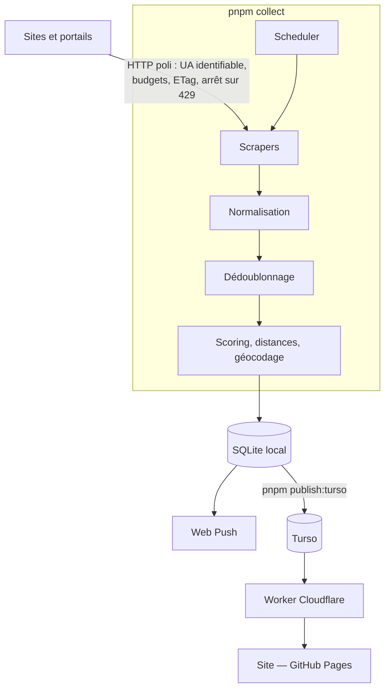

# Architecture

Carte du projet : ce que fait chaque partie et **où la lire**. Le détail vit
dans le code, largement commenté — une doc qui le répète dérive, celle-ci
annonçait encore 14 m² de surface minimale quand la configuration était à 20.

## Le flux

```
COLLECTER → NORMALISER → DÉDOUBLONNER → FILTRER → SCORER → PRIORISER → CONTACTER
```



La COLLECTE tourne où l'on veut : sur la machine (fichier SQLite) ou dans
GitHub Actions (Turso). Le SITE, lui, n'a plus qu'une forme — servi par GitHub
Pages, il parle à un Worker Cloudflare qui détient seul le jeton de la base et
tient les sessions (voir `docs/deployment.md`).

Il y avait un second chemin : un serveur local qui servait aussi le site depuis
la machine. Il a été retiré le 2026-09-04 — deux chemins pour le même écran,
c'était deux fois les mêmes cas à tenir. Ce qui est parti avec lui : le dépôt
des PIÈCES du dossier, qui vivaient sur ce disque-là.

`server/routes.ts` ne dépend que des standards Web et de l'interface `Client` de
libsql, jamais de `node:fs` : c'est ce qui lui permet de tourner dans un
Worker.

## Où lire quoi

| Sujet                      | Fichier                                                 |
| -------------------------- | ------------------------------------------------------- |
| Ordonnancement des sources | `collector/src/core/scheduler.ts`                       |
| Budgets et politesse HTTP  | `collector/src/core/budgets.ts`, `core/http-client.ts`  |
| Ajouter une source         | en-tête de `collector/src/sources/index.ts`             |
| Adaptateurs de plateforme  | `sources/apimo`, `hektor`, `adaptimmo`, `ics`           |
| Normalisation des champs   | `collector/src/normalization/`                          |
| Dédoublonnage              | `collector/src/deduplication/`                          |
| Scoring                    | `collector/src/scoring/`                                |
| Schéma et migrations       | `database/migrations/`                                  |
| Enchaînement complet       | `collector/src/pipeline.ts`                             |
| Critères de recherche      | `app_settings` (base), défauts `shared/src/criteria.ts` |
| Recherches enregistrées    | `frontend/src/saved-searches.ts`                        |
| Réglages partagés en base  | `app_settings` (voir `shared/src/source.ts`)            |

## Les écrans

Quatre destinations, les MÊMES sur téléphone (barre basse) et sur grand écran
(onglets du haut) — passer de l'un à l'autre ne doit rien faire réapprendre :

| Écran          | Fichier                        | Ce qu'il répond                              |
| -------------- | ------------------------------ | -------------------------------------------- |
| **Accueil**    | `components/HomePanel.tsx`     | Qu'est-ce qui a bougé, et qu'ai-je à faire ? |
| **Recherche**  | `App.tsx` (liste + carte)      | Que puis-je contacter en ce moment ?         |
| **Favoris**    | la même liste, filtrée         | Qu'ai-je retenu ?                            |
| **Paramètres** | `components/SettingsLinks.tsx` | Les chemins vers tout le reste               |

Sous les Paramètres : profil locataire, dossier de candidature, notifications,
recherches enregistrées, statistiques, état des sources — et, depuis celui-ci,
la fiche d'une source (`components/SourcePanel.tsx`) avec ses annonces actives.

L'accueil n'est PAS la liste. C'était le cas, et ouvrir l'application posait
une question à laquelle on venait rarement répondre d'emblée (« que contient
tout le stock ? ») plutôt que celle qu'on se pose vraiment.

Les **réglages qui doivent suivre l'utilisateur d'un appareil à l'autre** —
critères de recherche, recherches enregistrées — vivent dans la table
`app_settings` de la base, seul point de rencontre entre la collecte et le site
publié. Ceux qui ne valent que pour CE navigateur — tri, filtres d'affichage,
alertes écartées — restent dans son stockage local.

## Les quatre scores

Calculés sur 100 pour chaque logement, avec trois règles transverses :

- **Jamais de donnée inventée** (§17) : un signal absent ne contribue pas et
  figure dans `unknownSignals`.
- **Toujours explicable** (§19) : chaque score rend ses `reasons[]`, affichées
  telles quelles dans la fiche.
- **Confiance affichée** : `confidence` décroît avec chaque signal manquant.

`match` (correspond aux critères), `opportunity` (fraîcheur, rareté),
`visitProbability` (chances d'obtenir une visite), `risk` (signaux douteux —
prix anormalement bas, bailleur non identifiable).

## Dédoublonnage

Deux annonces du même bien doivent former **une seule fiche**, sans jamais
fusionner deux biens distincts : une fusion erronée fait disparaître un
logement réel (§14).

Le rapprochement se fait en deux temps — des clés de blocage désignent les
paires à comparer, puis une comparaison fine tranche. Les signaux les plus
sûrs : une photo commune, un téléphone, une référence d'agence. Les plus
faibles — prix, surface, quartier — ne suffisent pas seuls.

En dessous du seuil, la paire reste affichée en double : mieux vaut un doublon
visible qu'une annonce perdue.

## Décisions structurantes

- **SQLite en fichier** : aucune infrastructure à gérer, sauvegarde par copie.
  Turso n'entre en jeu que pour publier, et ne reçoit jamais de donnée
  personnelle (voir `docs/privacy.md`).
- **Occurrences et fiches séparées** : chaque source garde ce qu'elle a publié
  (`occurrences`), la fiche agrégée (`listings`) porte la fusion et son
  historique de désaccords (§15).
- **Rien n'est envoyé sans action explicite** (§22) : le projet compose des
  messages et crée des brouillons, il n'envoie jamais.
- **Aucun contournement d'anti-bot** (§10) : les portails qui l'interdisent
  sont lus par leurs alertes e-mail, dans la boîte de l'utilisateur.

## Ce que le multi-compte partage, et ce qu'il sépare

La question se pose dès qu'on ajoute un second compte : **qui voit quoi**, et
que deviennent les accès qui sont NOMINATIFS — un abonnement payé, une boîte
mail.

La réponse tient en une ligne : **la collecte est unique et commune, l'usage
est personnel.**

| Ce qui est COMMUN                 | Ce qui appartient à CHACUN                   |
| --------------------------------- | -------------------------------------------- |
| Les annonces et leurs occurrences | Favoris, suivi, archivage, consulté          |
| L'état de santé des sources       | Critères de recherche (`app_settings`)       |
| Le journal des collectes          | Recherches enregistrées, adresses de réf.    |
| Le cache de géocodage             | Préférences d'alertes, abonnements push      |
|                                   | Pièces du dossier (KV, préfixées par compte) |

### Pourquoi la collecte reste unique

**L'accès abonné BEP est le vôtre, et il le reste.** Un abonnement payé est
nominatif : le décliner par compte reviendrait à le prêter. Il vit donc dans le
`.env` de la MACHINE QUI COLLECTE, jamais en base, jamais rattaché à un compte
du site. Les annonces qu'il révèle entrent dans la base commune — c'est le prix
d'une collecte partagée, et c'est assumé. Qui ne le veut pas laisse les deux
lignes vides : la source retombe en mode public.

**Les alertes e-mail arrivent par TRANSFERT, depuis le 2026-09-05.** Le
collecteur lit une seule boîte, celle du projet ; chaque compte y fait suivre
ses propres alertes depuis la sienne.

C'est l'utilisateur qui pose la règle de transfert, dans sa messagerie, et qui
la retire quand il veut. **Nous ne détenons aucun de ses identifiants.** L'écran
Paramètres → Alertes des portails lui donne une adresse qui n'est qu'à lui,
`alertes+<jeton>@…`, où le jeton vient de la colonne `users.alert_token`. Ce
jeton n'est pas un secret de connexion : il rend l'adresse indevinable — sans
lui, une adresse commune serait publique et n'importe qui pourrait y déverser ce
qu'il veut — et il dit quel compte a transféré.

Le gabarit vit dans `ALERT_ADDRESS_TEMPLATE` (Worker et collecteur). Vide,
l'écran dit que la fonctionnalité n'est pas configurée au lieu d'afficher une
adresse : une règle de transfert vers le vide n'échoue jamais bruyamment, et
l'utilisateur attendrait pour rien des alertes qui ne viendraient jamais (§17).

### Pourquoi pas OAuth

La question s'est posée le 2026-09-05, et OAuth a été écarté pour trois raisons
dont chacune suffirait :

1. **Il ne couvre pas les boîtes visées.** OAuth existe chez Google et
   Microsoft. Les messageries des utilisateurs français — laposte.net, Orange,
   Free, SFR, Bouygues — n'offrent que l'IMAP avec mot de passe. Le premier
   utilisateur du projet est chez laposte.net : la voie « propre » ne l'aurait
   pas servi.
2. **Lire des messages est un périmètre RESTREINT chez Google.** Passer en
   production exige une évaluation de sécurité annuelle et payante. Sans elle :
   cent utilisateurs au plus, un écran d'avertissement, et surtout des jetons de
   rafraîchissement qui expirent tous les SEPT JOURS — intenable pour un
   collecteur qui tourne seul toutes les demi-heures.
3. **Il faudrait quand même conserver quelque chose.** Un jeton de
   rafraîchissement par compte, en base, ouvrant sa boîte personnelle. C'est
   mieux qu'un mot de passe d'application — révocable, limité à la lecture —
   mais ce n'est pas rien, là où le transfert ne demande rien du tout.

**Ce qui reste commun.** Les annonces issues d'un transfert entrent dans la base
COMMUNE, comme toutes les autres : ce qu'un compte fait suivre profite à tous.
C'est la contrepartie assumée d'une collecte partagée, et c'est aussi ce qui
fait la valeur du gisement.

## Limites connues

- La plupart des annonces viennent des alertes e-mail des portails, qui ne
  publient **ni téléphone ni adresse** : le contact direct reste rare.
- Les liens de tracking des portails périment ; ils sont résolus en URL
  canonique à la collecte, mais un lien déjà mort ne se rattrape pas.
- Le géocodage dépend de l'adresse publiée, souvent absente.
