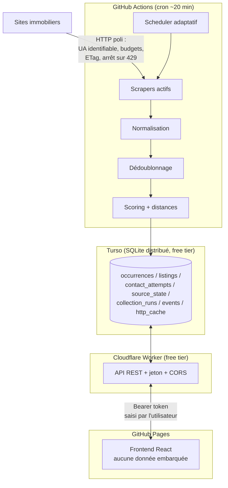

# Architecture

## Vue d'ensemble

RentFinder est composé de quatre parties indépendantes, reliées uniquement par
la base Turso et par les types du paquet `@rentfinder/shared` :



Le flux de données suit la chaîne du §78 :

```
COLLECTER → NORMALISER → DÉDOUBLONNER → FILTRER → SCORER → PRIORISER → CONTACTER → MESURER
```

## Composants et responsabilités

### `packages/shared` — contrats

Types partagés par tout le système, aucune logique, aucune dépendance (§48).
Contient le modèle de données à quatre étages :

```
RawListing            ce qu'un scraper extrait (chaînes brutes)
  ↓ normalisation
NormalizedListing     annonce typée, propre à UNE source (= une "occurrence")
  ↓ dédoublonnage + fusion
AggregatedListing     un logement unique, champs MergedField<T> avec provenance
  ↓ scoring
ScoredListing         + 4 scores expliqués + distances + matchesCriteria
```

Deux types transversaux portent les principes du projet :

- `Maybe<T> = T | null` — `null` signifie « la source ne fournit pas cette
  information ». Jamais remplacé par une estimation (§17).
- `MergedField<T>` — valeur retenue + source + **conflits conservés** quand les
  sources divergent (§15).

Le module `message.ts` (génération des messages de contact) vit ici parce que
le frontend (mode manuel) et le collecteur (mode auto futur) l'utilisent tous
deux (§24, §75).

### `packages/collector` — collecte et pipeline

| Répertoire       | Rôle                                                                                                                              |
| ---------------- | --------------------------------------------------------------------------------------------------------------------------------- |
| `core/`          | clock injectable, logger auto-expurgeant, rate limiter, client HTTP (point de passage unique), budgets par famille, registre, géo |
| `scheduler/`     | décisions pures « quelle source tourne maintenant » (§7)                                                                          |
| `sources/`       | un répertoire par source : `parser.ts` (pur) + `index.ts` (scraper)                                                               |
| `normalization/` | texte français, nombres français, champs d'annonce                                                                                |
| `deduplication/` | similarité multi-signaux, blocage, union-find, fusion                                                                             |
| `scoring/`       | les 4 scores + distances                                                                                                          |
| `contact/`       | garde-fous du contact automatique (`guards.ts`)                                                                                   |
| `db/`            | client libsql, migrations, repository économe en écritures                                                                        |
| `cli/`           | `collect.ts` et `migrate.ts`, appelés par GitHub Actions                                                                          |
| `pipeline.ts`    | orchestration d'un run complet, isolation des pannes                                                                              |

Frontières strictes :

- Un **scraper** ne fait qu'extraire. Il ne parse pas les nombres, ne
  normalise pas, n'écrit pas en base, et n'appelle jamais `fetch` directement —
  il reçoit un `ScrapeContext` dont le `fetch` applique budget, cache et arrêt
  sur 429 (§10, §76).
- La **normalisation** ne connaît aucune particularité de site.
- Le **repository** est le seul code qui parle SQL.

### `packages/api` — Cloudflare Worker

Rôle unique : exposer les données Turso au frontend sans que le bundle public
ne contienne jamais de credentials (§26, §28). Authentification par jeton
Bearer comparé en temps constant, CORS restreint à l'origine GitHub Pages,
API fermée (503) si le jeton serveur n'est pas configuré.

### `frontend/` — interface

React + Vite, trois vues (liste / fiche / profil+sources), **zéro dépendance**
au-delà de React (§39, §65). Deux modes automatiques :

- **démo** : pas de `VITE_API_URL` → données fictives de `mock-data.ts` ;
- **connecté** : jeton saisi par l'utilisateur, stocké en `localStorage`.

Le profil locataire est stocké uniquement dans le navigateur ; le message de
contact est composé localement et n'est jamais transmis à l'API (§25, §26).

## Décisions structurantes et leurs raisons

| Décision                                                  | Raison                                                                                                                                 |
| --------------------------------------------------------- | -------------------------------------------------------------------------------------------------------------------------------------- |
| TypeScript partout                                        | un seul modèle de données partagé compilé, une seule CI, pas de double maintenance Pydantic/TS                                         |
| API serverless + jeton plutôt que JSON statique sur Pages | un JSON public exposerait annonces suivies, statuts de contact et distances (triangulation du lieu de travail) — contraire aux §20/§26 |
| Fichier SQLite = Turso en test                            | même API libsql ; les tests d'intégration exercent le vrai code sans toucher la production (§52)                                       |
| `content_hash` par ligne                                  | une annonce revue à l'identique ne coûte aucune écriture Turso (§30)                                                                   |
| Dédoublonnage par blocage + union-find                    | O(n²) interdit au-delà de quelques milliers d'annonces (§56)                                                                           |
| Paires ambiguës **non** fusionnées par défaut             | fusionner deux logements distincts fait disparaître une annonce réelle ; un doublon affiché est moins grave (§14)                      |
| Horloge injectable (`Clock`)                              | tests déterministes, aucune dépendance à l'heure réelle (§59)                                                                          |
| Un seul workflow de collecte                              | le scheduler interne décide ; ajouter une source n'ajoute pas de workflow (§29)                                                        |

## Limites connues

- Les distances sont à vol d'oiseau × 1,3 (facteur urbain), pas des itinéraires
  réels — suffisant pour classer, pas pour planifier (§20 MVP).
- `VISIT PROBABILITY` est un indice à base de règles, pas une statistique ;
  l'interface l'affiche avec cet avertissement (§18).
- La collecte dépend de la ponctualité des crons GitHub Actions, qui n'est pas
  garantie (retards de quelques minutes fréquents).
- Le tri « annonces les plus fraîches d'abord » suppose que la source liste les
  nouveautés en tête — vrai pour Laforêt, à vérifier par source (§9).
