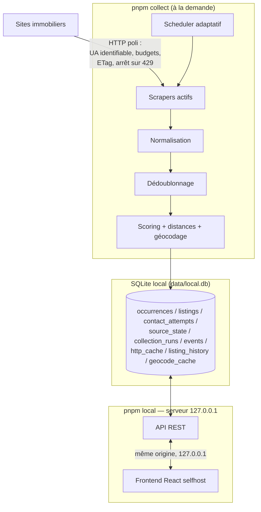

# Architecture

## Vue d'ensemble

RentFinder est **100% local** : tout tourne sur la machine de l'utilisateur,
relié par un fichier SQLite et par les types du paquet `@rentfinder/shared` :



Le flux de données suit la chaîne du §78 :

```
COLLECTER → NORMALISER → DÉDOUBLONNER → FILTRER → SCORER → PRIORISER → CONTACTER → MESURER
```

## Composants et responsabilités

### `packages/shared` — contrats

Types partagés par tout le système, aucune logique, aucune dépendance (§48).
Contient le modèle de données à quatre étages :

```
RawListing            ce qu'un scraper extrait (chaînes brutes)
  ↓ normalisation
NormalizedListing     annonce typée, propre à UNE source (= une "occurrence")
  ↓ dédoublonnage + fusion
AggregatedListing     un logement unique, champs MergedField<T> avec provenance
  ↓ scoring
ScoredListing         + 4 scores expliqués + distances + matchesCriteria
```

Deux types transversaux portent les principes du projet :

- `Maybe<T> = T | null` — `null` signifie « la source ne fournit pas cette
  information ». Jamais remplacé par une estimation (§17).
- `MergedField<T>` — valeur retenue + source + **conflits conservés** quand les
  sources divergent (§15).

Le module `message.ts` (génération des messages de contact) vit ici parce que
le frontend (mode manuel) et le collecteur (mode auto futur) l'utilisent tous
deux (§24, §75).

### `packages/collector` — collecte et pipeline

| Répertoire       | Rôle                                                                                                                              |
| ---------------- | --------------------------------------------------------------------------------------------------------------------------------- |
| `core/`          | clock injectable, logger auto-expurgeant, rate limiter, client HTTP (point de passage unique), budgets par famille, registre, géo |
| `scheduler/`     | décisions pures « quelle source tourne maintenant » (§7)                                                                          |
| `sources/`       | un répertoire par source : `parser.ts` (pur) + `index.ts` (scraper)                                                               |
| `normalization/` | texte français, nombres français, champs d'annonce                                                                                |
| `deduplication/` | similarité multi-signaux, blocage, union-find, fusion                                                                             |
| `scoring/`       | les 4 scores + distances                                                                                                          |
| `contact/`       | garde-fous du contact automatique (`guards.ts`)                                                                                   |
| `db/`            | client libsql, migrations, repository économe en écritures                                                                        |
| `cli/`           | `collect.ts` (collecte), `serve.ts` (serveur local), `migrate.ts`                                                                 |
| `server/`        | routes de l'API locale (`routes.ts`)                                                                                              |
| `pipeline.ts`    | orchestration d'un run complet, isolation des pannes                                                                              |

Frontières strictes :

- Un **scraper** ne fait qu'extraire. Il ne parse pas les nombres, ne
  normalise pas, n'écrit pas en base, et n'appelle jamais `fetch` directement —
  il reçoit un `ScrapeContext` dont le `fetch` applique budget, cache et arrêt
  sur 429 (§10, §76).
- La **normalisation** ne connaît aucune particularité de site.
- Le **repository** est le seul code qui parle SQL.

### `collector/src/server` — API locale

Les routes REST (`routes.ts`) consommées par le serveur local (`cli/serve.ts`).
Le serveur n'écoute que sur `127.0.0.1` : injoignable depuis le réseau ou
Internet, donc **aucun jeton nécessaire**. Ne jamais changer l'adresse
d'écoute sans réintroduire une authentification (§26).

### `frontend/` — interface

React + Vite, trois vues (liste / fiche / profil+sources). Deux modes :

- **démo** (`pnpm dev`) : données fictives de `mock-data.ts`, sans base ;
- **local** (`pnpm local`) : servi par le serveur local, même origine.

Le profil locataire est stocké uniquement dans le navigateur ; le message de
contact est composé localement et n'est jamais transmis à l'API (§25, §26).

## Décisions structurantes et leurs raisons

| Décision                                      | Raison                                                                                                            |
| --------------------------------------------- | ----------------------------------------------------------------------------------------------------------------- |
| TypeScript partout                            | un seul modèle de données partagé compilé, une seule CI                                                           |
| 100% local (SQLite + serveur 127.0.0.1)       | pas de quota, pas de secret à gérer ; les données ne quittent jamais la machine (§26)                             |
| Base en mémoire en test                       | même API libsql ; les tests exercent le vrai code sans toucher la base de travail (§52)                           |
| `content_hash` par ligne                      | une annonce revue à l'identique ne coûte aucune écriture (§30)                                                    |
| Dédoublonnage par blocage + union-find        | O(n²) interdit au-delà de quelques milliers d'annonces (§56)                                                      |
| Paires ambiguës **non** fusionnées par défaut | fusionner deux logements distincts fait disparaître une annonce réelle ; un doublon affiché est moins grave (§14) |
| Horloge injectable (`Clock`)                  | tests déterministes, aucune dépendance à l'heure réelle (§59)                                                     |

## Limites connues

- Les distances sont à vol d'oiseau × 1,3 (facteur urbain), pas des itinéraires
  réels — suffisant pour classer, pas pour planifier (§20 MVP).
- `VISIT PROBABILITY` est un indice à base de règles, pas une statistique ;
  l'interface l'affiche avec cet avertissement (§18).
- La collecte est déclenchée manuellement (`pnpm collect`) : à vous de la
  relancer pour rafraîchir. Pas de collecte automatique en arrière-plan.
- Le tri « annonces les plus fraîches d'abord » suppose que la source liste les
  nouveautés en tête — vrai pour Laforêt, à vérifier par source (§9).
