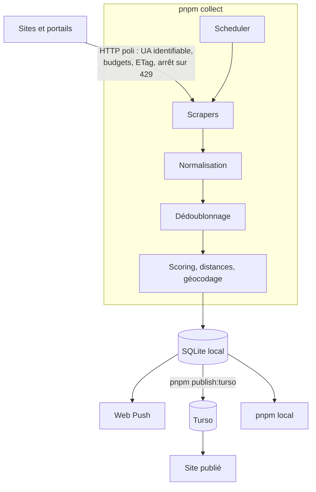

# Architecture

Carte du projet : ce que fait chaque partie et **où la lire**. Le détail vit
dans le code, largement commenté — une doc qui le répète dérive, celle-ci
annonçait encore 14 m² de surface minimale quand la configuration était à 20.

## Le flux

```
COLLECTER → NORMALISER → DÉDOUBLONNER → FILTRER → SCORER → PRIORISER → CONTACTER
```



Deux modes coexistent : **local** (tout sur la machine, base SQLite) et
**publié** (le site lit Turso directement, voir `docs/deployment.md`).

## Où lire quoi

| Sujet                      | Fichier                                                |
| -------------------------- | ------------------------------------------------------ |
| Ordonnancement des sources | `collector/src/core/scheduler.ts`                      |
| Budgets et politesse HTTP  | `collector/src/core/budgets.ts`, `core/http-client.ts` |
| Ajouter une source         | en-tête de `collector/src/sources/index.ts`            |
| Adaptateurs de plateforme  | `sources/apimo`, `hektor`, `adaptimmo`, `ics`          |
| Normalisation des champs   | `collector/src/normalization/`                         |
| Dédoublonnage              | `collector/src/deduplication/`                         |
| Scoring                    | `collector/src/scoring/`                               |
| Schéma et migrations       | `database/migrations/`                                 |
| Enchaînement complet       | `collector/src/pipeline.ts`                            |
| Critères de recherche      | `config/search.json`, `shared/src/criteria.ts`         |
| Recherches enregistrées    | `frontend/src/saved-searches.ts`                       |
| Réglages partagés en base  | `app_settings` (voir `shared/src/source.ts`)           |

## Les écrans

Quatre destinations, les MÊMES sur téléphone (barre basse) et sur grand écran
(onglets du haut) — passer de l'un à l'autre ne doit rien faire réapprendre :

| Écran          | Fichier                        | Ce qu'il répond                              |
| -------------- | ------------------------------ | -------------------------------------------- |
| **Accueil**    | `components/HomePanel.tsx`     | Qu'est-ce qui a bougé, et qu'ai-je à faire ? |
| **Recherche**  | `App.tsx` (liste + carte)      | Que puis-je contacter en ce moment ?         |
| **Favoris**    | la même liste, filtrée         | Qu'ai-je retenu ?                            |
| **Paramètres** | `components/SettingsLinks.tsx` | Les chemins vers tout le reste               |

Sous les Paramètres : profil locataire, dossier de candidature, notifications,
recherches enregistrées, statistiques, état des sources — et, depuis celui-ci,
la fiche d'une source (`components/SourcePanel.tsx`) avec ses annonces actives.

L'accueil n'est PAS la liste. C'était le cas, et ouvrir l'application posait
une question à laquelle on venait rarement répondre d'emblée (« que contient
tout le stock ? ») plutôt que celle qu'on se pose vraiment.

Les **réglages qui doivent suivre l'utilisateur d'un appareil à l'autre** —
critères de recherche, recherches enregistrées — vivent dans la table
`app_settings` de la base, seul point de rencontre entre la collecte et le site
publié. Ceux qui ne valent que pour CE navigateur — tri, filtres d'affichage,
alertes écartées — restent dans son stockage local.

## Les quatre scores

Calculés sur 100 pour chaque logement, avec trois règles transverses :

- **Jamais de donnée inventée** (§17) : un signal absent ne contribue pas et
  figure dans `unknownSignals`.
- **Toujours explicable** (§19) : chaque score rend ses `reasons[]`, affichées
  telles quelles dans la fiche.
- **Confiance affichée** : `confidence` décroît avec chaque signal manquant.

`match` (correspond aux critères), `opportunity` (fraîcheur, rareté),
`visitProbability` (chances d'obtenir une visite), `risk` (signaux douteux —
prix anormalement bas, bailleur non identifiable).

## Dédoublonnage

Deux annonces du même bien doivent former **une seule fiche**, sans jamais
fusionner deux biens distincts : une fusion erronée fait disparaître un
logement réel (§14).

Le rapprochement se fait en deux temps — des clés de blocage désignent les
paires à comparer, puis une comparaison fine tranche. Les signaux les plus
sûrs : une photo commune, un téléphone, une référence d'agence. Les plus
faibles — prix, surface, quartier — ne suffisent pas seuls.

En dessous du seuil, la paire reste affichée en double : mieux vaut un doublon
visible qu'une annonce perdue.

## Décisions structurantes

- **SQLite en fichier** : aucune infrastructure à gérer, sauvegarde par copie.
  Turso n'entre en jeu que pour publier, et ne reçoit jamais de donnée
  personnelle (voir `docs/privacy.md`).
- **Occurrences et fiches séparées** : chaque source garde ce qu'elle a publié
  (`occurrences`), la fiche agrégée (`listings`) porte la fusion et son
  historique de désaccords (§15).
- **Rien n'est envoyé sans action explicite** (§22) : le projet compose des
  messages et crée des brouillons, il n'envoie jamais.
- **Aucun contournement d'anti-bot** (§10) : les portails qui l'interdisent
  sont lus par leurs alertes e-mail, dans la boîte de l'utilisateur.

## Limites connues

- La plupart des annonces viennent des alertes e-mail des portails, qui ne
  publient **ni téléphone ni adresse** : le contact direct reste rare.
- Les liens de tracking des portails périment ; ils sont résolus en URL
  canonique à la collecte, mais un lien déjà mort ne se rattrape pas.
- Le géocodage dépend de l'adresse publiée, souvent absente.
